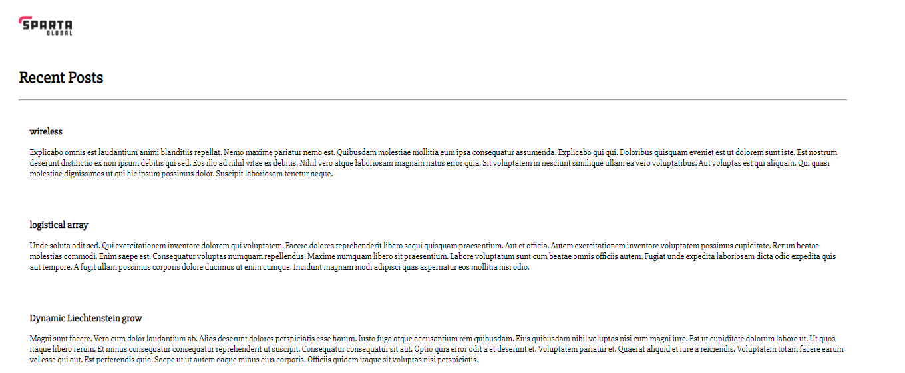

# Automation of multi machine setup using Vagrant & provisioning
```Monolith Architecture for our Nodejs APP

With vagrant up you should be able to launch 2 VMs called app and db
provision nodejs and mongodb in relevant VMs
cd app
npm start
should launch the app with connection to monogdb
192.168.10.100/posts must work with Reverse proxy set up using your provisioning script.
```
### Instalattion of Vagrant, VirtualBox and Ruby
```
Vagrant commands
vagrant up to launch the vm
vagrant destroy to delete everything
vagrant reload to reload any new instruction in our Vagrantfile
vagrant halt to pause the vm
More commands can be found by typing vagrant on gitbash terminal:
     autocomplete    manages autocomplete installation on host
     box             manages boxes: installation, removal, etc.
     cloud           manages everything related to Vagrant Cloud
     destroy         stops and deletes all traces of the vagrant machine
     global-status   outputs status Vagrant environments for this user
     halt            stops the vagrant machine
     help            shows the help for a subcommand
     init            initializes a new Vagrant environment by creating a Vagrantfile
     login
     package         packages a running vagrant environment into a box
     plugin          manages plugins: install, uninstall, update, etc.
     port            displays information about guest port mappings
     powershell      connects to machine via powershell remoting
     provision       provisions the vagrant machine
     push            deploys code in this environment to a configured destination
     rdp             connects to machine via RDP
     reload          restarts vagrant machine, loads new Vagrantfile configuration
     resume          resume a suspended vagrant machine
     snapshot        manages snapshots: saving, restoring, etc.
     ssh             connects to machine via SSH
     ssh-config      outputs OpenSSH valid configuration to connect to the machine
     status          outputs status of the vagrant machine
     suspend         suspends the machine
     up              starts and provisions the vagrant environment
     upload          upload to machine via communicator
     validate        validates the Vagrantfile
     version         prints current and latest Vagrant version
     winrm           executes commands on a machine via WinRM
     winrm-config    outputs WinRM configuration to connect to the machine
     ```
### Let's create Vagrantfile as below
```
Vagrant.configure("2") do |config|
  
  
  config.vm.define "app" do |app|
  config.vm.box = "ubuntu/xenial64"  
    app.vm.network "private_network", ip: "192.168.10.100"
    app.hostsupdater.aliases = ["development.local"]
    app.vm.synced_folder ".", "/home/vagrant/environment"
    app.vm.provision "shell", path: "environment/provision.sh"
  end
  config.vm.define "db" do |db|
    config.vm.box = "ubuntu/xenial64"
    db.vm.network "private_network", ip: "192.168.10.150"
    db.hostsupdater.aliases = ["database.local"]
  end
end
```

### Let's ssh into our db vm and  install mongodb
```
-first step to enter the key
sudo apt-key adv --keyserver hkp://keyserver.ubuntu.com:80 --recv D68FA50FEA312927
-To install mongodb
echo "deb https://repo.mongodb.org/apt/ubuntu xenial/mongodb-org/3.2 multiverse" | sudo tee /etc/apt/sources.list.d/mongodb-org-3.2.list
sudo apt-get update -y
sudo apt-get upgrade -y
# sudo apt-get install mongodb-org=3.2.20 -y
sudo apt-get install -y mongodb-org=3.2.20 mongodb-org-server=3.2.20 mongodb-org-shell=3.2.20 mongodb-org-mongos=3.2.20 mongodb-org-tools=3.2.20

- To configure mongod.conf
cd /etc
sudo nano mongod.conf
# network interfaces
net:
    port: 27017
    bindIp: 0.0.0.0

- let's restart, enable and check the status of mongod
sudo systemctl restart mongod
sudo systemctl enable mongod
sudo systemctl status mongod
```
## Let's go into the app VM
```
vagrant ssh app

sudo apt-get update -y
sudo apt-get upgrade -y
sudo apt-get install nginx -y
sudo echo "export DB_HOST=mongodb://192.168.10.150:27017/posts" >> ~/.bashrc
cd environment/app/
sudo install nodejs -y
sudo install npm -y
sudo node seeds/seed.js
npm start
mongodb-org-shell=3.2.20 mongodb-org-mongos=3.2.20 mongodb-org-tools=3.2.20
sudo systemctl restart mongod
sudo systemctl enable mongod
####From app:

source ~/.bashrc
npm start in app folder
if posts are connecting but not showing, do node seeds/seed.js
npm start
```
### Now, app can we viewed on the browser with data fetched from the database
- on http://192.168.10.100:3000/posts

- on http://192.168.10.100.3000/fibonacci/9

