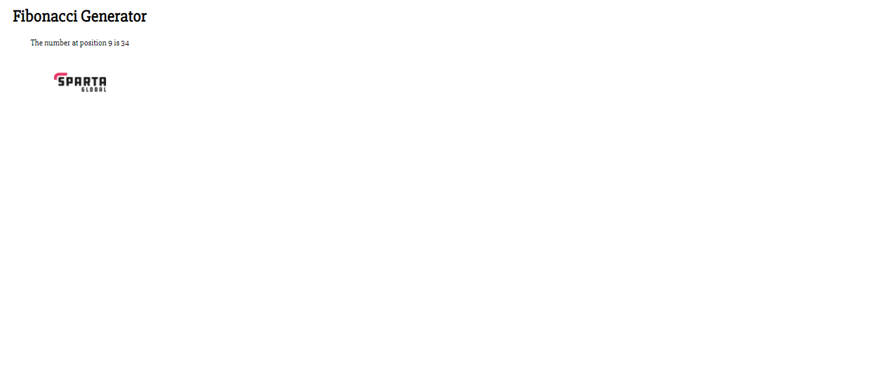

# Multi Machine(app & db) Automation using Vagrant
## Let's set up two Virtual Machines using Vagrantfile
* Vagrantfile should configure and sync the files from local to both app & db VMs
* User is not allowed to interact directly with the db
* app will be connected to the db and fetch the data to display.
* In the Vagrantfile, under each VM there will be provision.sh file to run automation scripts to set up VMs

### app is configured to 192.168.10.100 and connects to db @ 192.168.10.150

### Let's run the application simply using below command in the git Bash
* vagrant up

### Now, app can we viewed on the browser with data fetched from the database
- on http://192.168.10.100:3000/posts

- on http://192.168.10.100.3000/fibonacci/9

